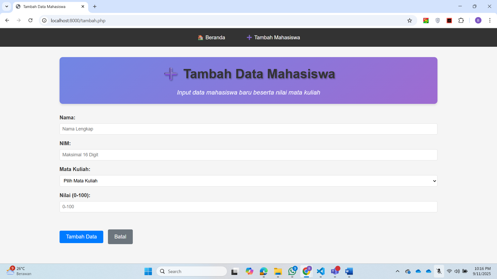

# 📚 Aplikasi Mini Daftar Mahasiswa & Nilai

## 🇮🇩 Deskripsi (Bahasa Indonesia)
Repository ini berisi aplikasi mini dengan tema **Daftar Mahasiswa & Nilai** yang dibangun menggunakan **PHP murni**, tanpa framework tambahan.  

### ✨ Fitur
- Menampilkan daftar mahasiswa beserta nilai dalam bentuk tabel.  
- Menambahkan data mahasiswa baru melalui form input.  
- Mengonversi nilai angka menjadi nilai huruf secara otomatis.  
- Menyimpan dan membaca data mahasiswa menggunakan **JSON** sebagai penyimpanan sederhana.  
- Tampilan dibuat dengan kombinasi **HTML** dan **CSS** agar lebih rapi dan mudah digunakan.  

### 📂 Struktur Project
- `index.php` → halaman utama daftar mahasiswa  
- `tambah.php` → form input mahasiswa baru  
- `style.css` → file CSS untuk tampilan  
- `data.json` → file JSON untuk menyimpan data mahasiswa  

---

## 🚀 Cara Menjalankan
1. Clone repository ini:
- $ git clone https://github.com/username/daftar-mahasiswa.git
2. Jalankan menggunakan server lokal (XAMPP/Laragon/Apache) atau melalui perintah berikut.
- $ cd daftar-mahasiswa
- $ php -S localhost:8000
3. Akses melalui browser di:
- http://localhost/daftar-mahasiswa/index.php
- atau
- http://localhost:8000/index.php

---

## 🛠️ Teknologi / Technologies
- `PHP`
- `HTML`
- `CSS`
- `JSON`

---

## 👨‍💻 Author
`Banar Pambudi`

---

## 📸 Demo Aplikasi

### Tampilan Awal

### Halaman Daftar Mahasiswa

### Halaman Tambah Mahasiswa

